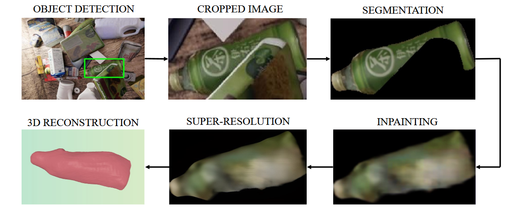
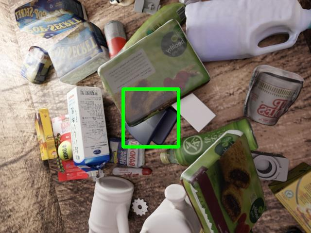
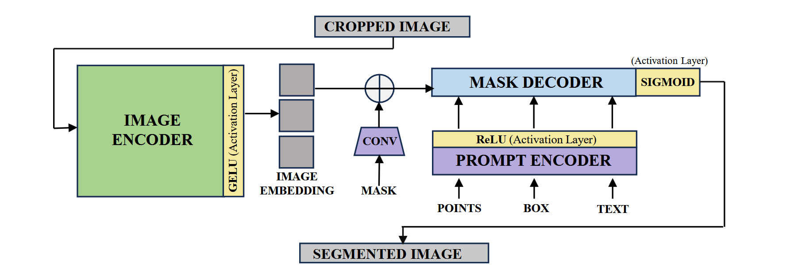
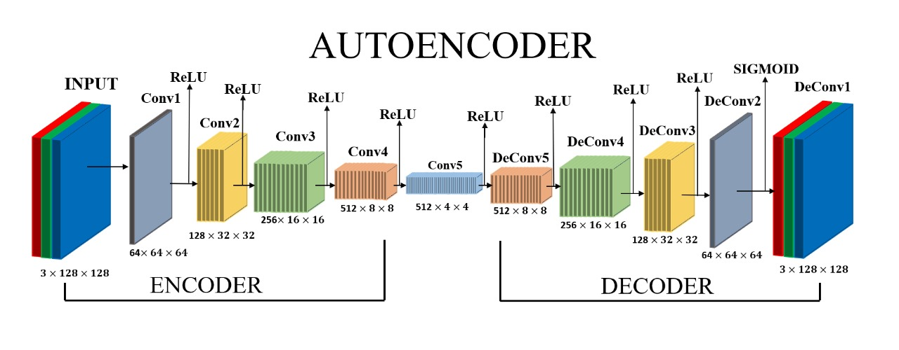
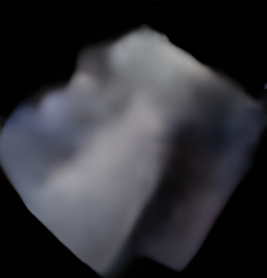
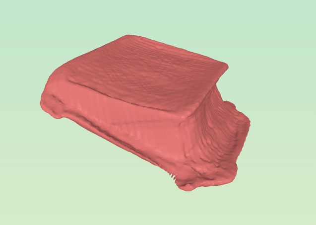

# **RESTORING OCCLUDED OBJECTS: FROM DETECTION TO 3D RECONSTRUCTION**

## Table of Contents
1. [Introduction](#overview)
2. [Motivation & Applications](#motivation--applications)
3. [Model Components](#model-components)
4. [Dataset Preparation](#dataset-preparation)
5. [Architectural Details](#architectural-details)
6. [Workflow Pipeline](#workflow-pipeline)
7. [3D Reconstruction and Mesh Remeshing](#3d-reconstruction-and-mesh-remeshing)
8. [Evaluation & Key Takeaways](#evaluation--key-takeaways)

## Requirements
- [LINK_TO_DOWNLOAD_PRE-TRAINED_MODELS](https://www.kaggle.com/datasets/sarveshchaudhari9325/cs299-pre-trained-models)

---

## Introduction

**Restoring Occluded Objects: From Detection to 3D Reconstruction** is a deep learning-based vision pipeline designed to detect, reconstruct, and reimagine occluded regions in RGB images. This multi-stage system integrates object detection, segmentation, inpainting, super-resolution, and 3D mesh generation into a unified framework. 
At its core, the project leverages a convolutional autoencoder to predict and restore missing pixel regions, supported by a YOLO-based detection system and transformer-based segmentation model. High-fidelity detail is preserved and enhanced using Real-ESRGAN for super-resolution, while the final stage transforms 2D predictions into structured 3D mesh representations using Instant Meshes. 
Implemented in PyTorch, this pipeline is built to handle challenging occlusion scenarios in real-world images—bridging the gap between 2D perception and 3D spatial understanding.

---

## Motivation & Applications
Imagine AR characters hiding behind real furniture, robots identifying partially hidden objects, or 3D sports analytics in occluded scenarios. This project enables machines to perceive occluded objects with human-like understanding.

### Applications:
- Surveillance and security in crowded scenes  
- Safer indoor navigation for robots  
- Autonomous driving under occlusion  
- Enhanced AR/VR immersion  
- Sports analytics for occluded athletes  
- Sorting occluded crops and clutter navigation  

---

## Model Components
1. **YOLOv11s** – Real-time object detection
2. **SAM (Segment Anything Model)** – Transformer-based segmentation
3. **Convolutional Autoencoder** – Pixel restoration/inpainting
4. **Real-ESRGAN** – Super-resolution enhancement
5. **Instant Meshes** – Mesh generation for 3D reconstruction

---

## Dataset Preparation
- Format: RGB images, YOLO-format labels, and visible/occluded masks
- Generated from COCO-style annotations
- Split into `train`, `val`, and `test`
- `dataset.yaml` for YOLO training compatibility

---

## Architectural Details

### 1. YOLOv11s (You Only Look Once)
YOLOv11s is responsible for detecting objects within an image by producing bounding boxes around them. It is chosen for its excellent trade-off between inference speed and accuracy, making it suitable for real-time applications. It initiates the pipeline by locating regions of interest (occluded objects) that other components will process further.

**Architecture:**
- `Backbone`: Lightweight CNN for fast feature extraction.
- `Neck`: Feature Pyramid Network (FPN) to fuse multi-scale features.
- `Head`: Predicts bounding boxes, confidence scores, and class labels.

**Activation Functions:**
- `SiLU`: Smooth and self-regularizing, improves learning in convolutional layers.
- `Sigmoid`: Used at the output layer to constrain confidence scores between 0 and 1.

**Loss Functions:**
- `λ_box`:  Measures bounding box regression error.
- `λ_obj`: Penalizes false positives/negatives.
- `λ_cls`: Optimizes class label predictions.

---

### 2. SAM (Segment Anything Model)

**Explanation & Role:**  
SAM performs segmentation using visual prompts (e.g., bounding boxes). It produces detailed masks corresponding to detected objects and is known for being general-purpose and highly accurate even with minimal tuning. It bridges detection and inpainting by localizing the object region pixel-wise.

**Architecture:**
- `Vision Transformer (ViT) Encoder`: extracts hierarchical image features.
- `Prompt Encoder`: encodes user-provided prompts like bounding boxes.
- `Mask Decoder`: generates high-resolution binary masks per object.

**Activation Functions:**
- `SiLU`: Used throughout transformer layers for smooth, non-linear transformation.

**Loss Functions:**
- `Binary Cross Entropy (BCE)`: For accurate binary mask prediction.
- `Dice Loss`: Ensures accurate segmentation especially on small/imbalanced regions.
- `IoU Loss`: Optimizes overlap between predicted and ground-truth masks.

---

### 3. Convolutional Autoencoder

**Explanation & Role:**  
The autoencoder is responsible for restoring occluded or missing pixel regions in segmented objects. It compresses image information, learns semantic and structural features, and reconstructs the missing parts. It brings continuity and completeness to partially visible data.

**Architecture:**
- `Encoder`: Multiple convolutional layers with ReLU to downsample input.
- `Bottleneck`: Fully Connected MLP that encodes image semantics.
- `Decoder`: Transposed Convolution layers to upsample and reconstruct image

**Activation Functions:**
- `ReLU`: Promotes efficient feature learning and avoids vanishing gradients.
- `Sigmoid`: Used in output layer to scale pixel values between 0 and 1.

**Loss Functions:**
- `Mean Squared Error (MSE)`: Measures pixel-wise deviation between original and reconstructed images. Preferred for regression-based reconstruction tasks.
---

### 4. Real-ESRGAN

**Explanation & Role:**  
Real-ESRGAN performs image super-resolution, improving the perceptual quality of both segmented and inpainted images. It is applied both before and after inpainting to maximize visual fidelity and clarity.

**Architecture:**
- `Generator`: Residual-in-Residual Dense Blocks with ReLU/Leaky ReLU.
- `Discriminator`: GAN-based network that distinguishes real vs. generated images.

**Activation Functions:**
- `ReLU / Leaky ReLU`: Supports stable learning and sharp reconstruction.
- `Sigmoid`: Ensures final pixel values are normalized.

**Loss Functions:**
- `Adversarial Loss`: Helps generate realistic image textures.
- `Perceptual Loss`: Uses pre-trained deep features to capture image semantics.
- `Pixel Loss (MSE/L1)`: Ensures fidelity to original low-resolution image during enhancement.
---

## Workflow Pipeline

1. **Object Detection** → YOLOv11s locates occluded objects  
2. **Segmentation** → SAM generates object masks  
3. **Super-Resolution (1)** → Real-ESRGAN enhances mask quality  
4. **Inpainting** → Autoencoder fills occlusions  
5. **Super-Resolution (2)** → Real-ESRGAN final enhancement  
6. **Optional** → Save masks, bounding boxes, all intermediates

---

## 3D Reconstruction and Mesh Remeshing

**Instant Meshes** transforms 2D output into quad-dominant 3D meshes:
- Uses **directional & position fields**
- **Quadrangulation** ensures smooth topology
- **Adaptive remeshing** adds detail where necessary

Ideal for simulation, animation, and AR applications.

---

## Evaluation & Key Takeaways

### Performance Metrics:
- `YOLO`: mAP (mean Average Precision)
- `Autoencoder`: PSNR, MSE
- `Real-ESRGAN`: SSIM, perceptual fidelity

### Key Insights:
- Autoencoder restores context effectively
- SAM produces high-quality masks with minimal input
- Real-ESRGAN enhances both semantic and pixel clarity
- Modular system design allows easy adaptation

---

## Tech Stack
- Python, PyTorch, OpenCV, PIL
- Ultralytics YOLO, Segment Anything, Real-ESRGAN
- Kaggle/Jupyter Environment
- 
---

## Future Work

- Integrate monocular depth estimation to improve 3D reconstruction from a single image.
- Explore transformer-based or diffusion-based inpainting models for better context modeling.
- Extend the pipeline to real-time inference for deployment on edge devices.
- Benchmark the pipeline on diverse, real-world datasets beyond synthetic occlusions.
- Fuse LiDAR or multi-view data to enhance spatial accuracy in the reconstruction stage.

## Acknowledgements

This project was developed as part of the **CS299: Project Course** course at the **Indian Institute of Technology Gandhinagar (IITGN)**.
We would like to thank **Prof. Shanmuganathan Raman** and **Soumyaratna Debnat** for their continuous mentorship and valuable feedback throughout the course of this work.

## References

- [YOLO by Ultralytics](https://github.com/ultralytics/ultralytics) – Object Detection  
- [Segment Anything (SAM) by Meta AI](https://github.com/facebookresearch/segment-anything) – Segmentation  
- [Real-ESRGAN](https://github.com/xinntao/Real-ESRGAN) – Super-Resolution  
- [Instant Meshes](https://github.com/wjakob/instant-meshes) – Mesh Quadrangulation  
- [UOAIS Dataset](https://github.com/gist-ailab/uoais) – Amodal Segmentation Dataset  
- [PyTorch](https://pytorch.org/) – Deep Learning Framework  

---
